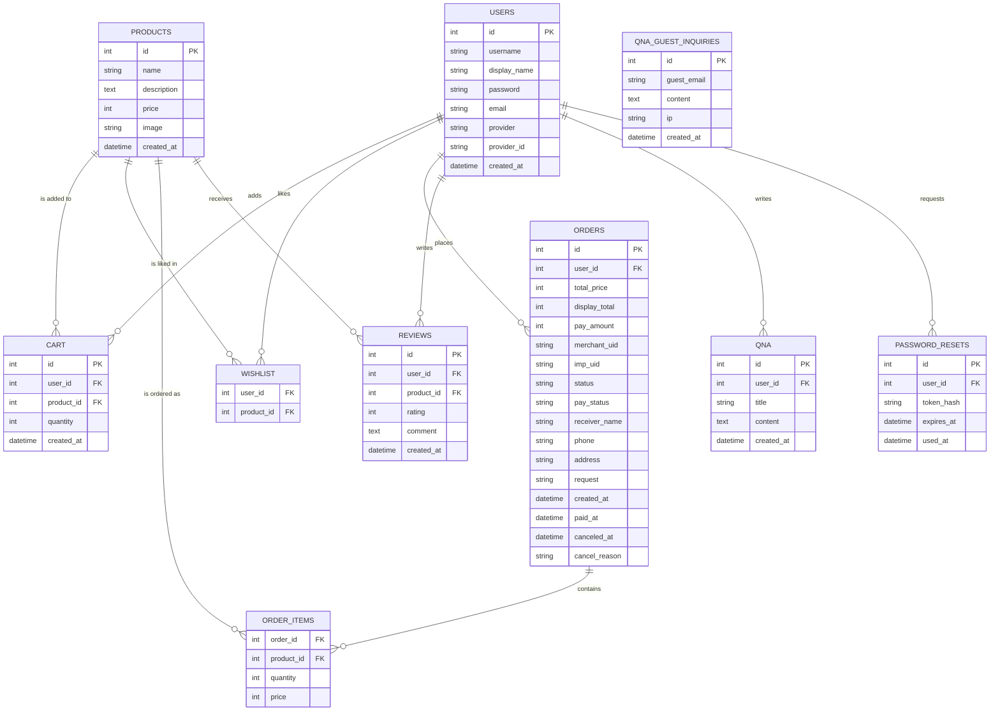

# Electronics Shop

## 목적

쇼핑몰 서비스의 사용자 기능과 관리자 기능이 어떻게 연결되는지 이해하기 위해 진행한 프로젝트입니다.  
회원, 상품, 주문, 결제, 문의 기능이 하나의 서비스 안에서 이어지는 흐름을 직접 구현해보는 데 목적을 두었습니다.


PHP와 MySQL로 구현한 전자제품 쇼핑몰 개인 프로젝트입니다. 일반적인 REST API 서버가 아니라, PHP 페이지와 Form 요청을 중심으로 동작하는 서버 렌더링 방식의 쇼핑몰입니다.

상품 목록, 상품 상세, 장바구니, 위시리스트, 주문, PortOne/Iamport 기반 카카오페이 결제 검증, 리뷰, Q&A, 비회원 문의, 관리자 주문 관리 기능을 구현했습니다.


## 기술 스택

| 구분 | 기술 |
| --- | --- |
| Backend | PHP |
| Database | MySQL, mysqli |
| Frontend | HTML, CSS, JavaScript |
| Auth | PHP Session, 일반 로그인, 카카오 로그인, 구글 로그인 |
| Payment | PortOne/Iamport, KakaoPay |
| Local Environment | XAMPP, Apache |

## 주요 기능

### 사용자 기능

- 회원가입, 로그인, 로그아웃
- PHP Session 기반 로그인 상태 관리
- 카카오/구글 소셜 로그인
- 상품 목록 조회
- 상품명 검색
- 가격 범위 필터링
- 최신순, 가격순, 평점순 정렬
- 상품 상세 조회
- 장바구니 담기, 수량 변경, 삭제, 비우기
- 위시리스트 추가, 삭제, 장바구니 이동
- 주문서 작성
- PortOne/Iamport SDK 기반 카카오페이 결제 요청
- 결제 완료 후 서버에서 결제 금액/상태/주문번호 검증
- 주문 내역 및 주문 상세 조회
- 리뷰 작성, 수정, 삭제
- Q&A 게시글 작성, 조회, 삭제
- 비회원 문의 작성
- 마이페이지에서 표시 이름 수정

### 관리자 기능

- 관리자 접근 제어
- 주문 목록 조회
- 주문 상태 필터링
- 주문 상태 변경
- 회원 목록 조회
- 리뷰 목록 조회 및 삭제
- 비회원 문의 조회

## 엔티티 목록

현재 저장소에는 DB 스키마 덤프 파일이 포함되어 있지 않습니다. 아래 내용은 실제 PHP 코드에서 조회/삽입/수정/삭제에 사용되는 테이블과 필드를 기준으로 정리했습니다.

| 테이블 | 주요 필드 | 설명 |
| --- | --- | --- |
| `users` | `id`, `username`, `display_name`, `password`, `email`, `provider`, `provider_id`, `login_type`, `kakao_id`, `google_id`, `created_at` | 일반 회원 및 소셜 로그인 사용자 |
| `products` | `id`, `name`, `description`, `price`, `image`, `created_at` | 판매 상품 |
| `cart` | `id`, `user_id`, `product_id`, `quantity`, `created_at` | 사용자별 장바구니 |
| `wishlist` | `user_id`, `product_id` | 사용자별 위시리스트 |
| `orders` | `id`, `user_id`, `total_price`, `display_total`, `pay_amount`, `merchant_uid`, `imp_uid`, `status`, `pay_status`, `receiver_name`, `phone`, `address`, `request`, `created_at`, `paid_at`, `canceled_at`, `cancel_reason` | 주문, 배송, 결제 상태 |
| `order_items` | `order_id`, `product_id`, `quantity`, `price` | 주문별 상품 목록 |
| `reviews` | `id`, `user_id`, `product_id`, `rating`, `comment`, `created_at` | 상품 리뷰 |
| `qna` | `id`, `user_id`, `title`, `content`, `created_at` | 회원 Q&A 게시글 |
| `qna_guest_inquiries` | `id`, `guest_email`, `content`, `ip`, `created_at` | 비회원 문의 |
| `password_resets` | `id`, `user_id`, `token_hash`, `expires_at`, `used_at` | 비밀번호 재설정 토큰 |

## 테이블 관계

- 한 `users`는 여러 `cart` 항목을 가질 수 있습니다. (`users.id` → `cart.user_id`)
- 한 `users`는 여러 `wishlist` 항목을 가질 수 있습니다. (`users.id` → `wishlist.user_id`)
- 한 `users`는 여러 `orders`를 생성할 수 있습니다. (`users.id` → `orders.user_id`)
- 한 `users`는 여러 `reviews`를 작성할 수 있습니다. (`users.id` → `reviews.user_id`)
- 한 `users`는 여러 `qna` 게시글을 작성할 수 있습니다. (`users.id` → `qna.user_id`)
- 한 `products`는 여러 `cart` 항목에 담길 수 있습니다. (`products.id` → `cart.product_id`)
- 한 `products`는 여러 `wishlist` 항목에 담길 수 있습니다. (`products.id` → `wishlist.product_id`)
- 한 `products`는 여러 `order_items`에 포함될 수 있습니다. (`products.id` → `order_items.product_id`)
- 한 `products`는 여러 `reviews`를 가질 수 있습니다. (`products.id` → `reviews.product_id`)
- 한 `orders`는 여러 `order_items`를 가질 수 있습니다. (`orders.id` → `order_items.order_id`)
- 한 `users`는 여러 `password_resets` 토큰을 가질 수 있습니다. (`users.id` → `password_resets.user_id`)

## ERD



## 페이지 및 요청 명세

이 프로젝트는 REST API 라우팅이 아니라 PHP 파일 단위의 페이지/폼 요청 구조입니다. 응답은 대부분 HTML 페이지 또는 처리 후 `Location` 헤더를 통한 리다이렉트입니다.

| 기능 | 경로 | 방식 | 요청 데이터 | 응답/처리 |
| --- | --- | --- | --- | --- |
| 상품 목록 | `/index.php` | GET | `q`, `min_price`, `max_price`, `sort` | 상품 목록 HTML, 평균 평점/리뷰 수 포함 |
| 상품 상세 | `/product_detail.php` | GET | `id` 또는 `product_id` | 상품 상세 HTML, 리뷰 목록 표시 |
| 로그인 | `/login.php` | GET/POST | POST: `username`, `password` | 성공 시 세션 저장 후 메인 이동 |
| 회원가입 | `/register.php` | GET/POST | POST: `username`, `display_name`, `email`, `password`, `password2` | 사용자 생성 및 세션 저장, 가입 완료 안내 |
| 아이디 찾기 | `/auth/find_id.php` | GET/POST | POST: `email` | 이메일에 해당하는 아이디 표시 |
| 비밀번호 재설정 요청 | `/auth/forgot_password.php` | GET/POST | POST: `action=request_reset`, `username` | 재설정 토큰 생성 |
| 비밀번호 재설정 | `/auth/reset_password.php` | GET/POST | GET: `token`, POST: `new_password`, `new_password2` | 토큰 검증 후 비밀번호 변경 |
| 카카오 로그인 시작 | `/kakao/kakao_login.php` | GET | 없음 | 카카오 인증 페이지로 이동 |
| 카카오 로그인 콜백 | `/kakao/kakao_callback.php` | GET | `code` | 사용자 조회/생성 후 세션 저장 |
| 구글 로그인 시작 | `/google/google_login.php` | GET | 없음 | 구글 인증 페이지로 이동 |
| 구글 로그인 콜백 | `/google/google_callback.php` | GET | `code` | 사용자 조회/생성 후 세션 저장 |
| 장바구니 조회 | `/cart/cart.php` | GET | 없음 | 로그인 사용자의 장바구니 HTML |
| 장바구니 추가 | `/cart/add_to_cart.php` | POST | `product_id`, `quantity`, `move_from_wishlist` | 장바구니 추가 후 장바구니 페이지 이동 |
| 장바구니 수량 변경 | `/cart/update_cart.php` | POST | `cart_id`, `quantity` | 수량 변경 후 장바구니 페이지 이동 |
| 장바구니 항목 삭제 | `/cart/remove_from_cart.php` | POST | `cart_id` | 항목 삭제 후 장바구니 페이지 이동 |
| 장바구니 비우기 | `/cart/clear_cart.php` | POST | 없음 | 전체 삭제 후 장바구니 페이지 이동 |
| 위시리스트 조회 | `/wishlist/wishlist.php` | GET | 없음 | 위시리스트 HTML |
| 위시리스트 추가 | `/wishlist/wishlist_add.php` | GET/POST | `product_id` | 중복 방지 후 이전 페이지 이동 |
| 위시리스트 삭제 | `/wishlist/wishlist_remove.php` | POST | `product_id` | 삭제 후 위시리스트 페이지 이동 |
| 주문서 작성 | `/order/checkout.php` | GET/POST | POST: `receiver_name`, `phone`, `address`, `request` | 주문 생성/갱신 후 결제 페이지 이동 |
| 주문 생성 | `/order/create_order.php` | POST | `receiver_name`, `phone`, `address`, `request`, `display_total`, `pay_amount` | 주문 생성 후 결제 페이지 이동 |
| 주문 내역 | `/order/my_orders.php` | GET | 없음 | 사용자 주문 목록 HTML |
| 주문 상세 | `/order/order_detail.php` | GET | `id` | 주문 상세 및 주문 상품 목록 HTML |
| 결제 요청 | `/Payment/payment.php` | GET | `order_id` | PortOne SDK로 카카오페이 결제 요청 화면 |
| 결제 검증 | `/Payment/payment_verify.php` | GET | `imp_uid`, `merchant_uid` | PortOne API 조회 후 주문 상태 갱신 |
| 결제 취소 | `/Payment/payment_cancel.php` | POST | `order_id` | PortOne API 취소 요청 후 주문 상태 변경 |
| 리뷰 작성/수정 | `/review/review_add.php` | POST | `product_id`, `rating`, `comment`, `review_id` | 리뷰 생성 또는 본인 리뷰 수정 |
| 리뷰 수정 화면 | `/review/review_edit.php` | GET | `review_id`, `product_id` | 본인 리뷰 수정 폼 |
| 리뷰 삭제 | `/review/review_delete.php` | POST | `review_id`, `product_id` | 본인 리뷰 삭제 |
| Q&A 목록 | `/qna/qna_list.php` | GET | `q`, `page` | 검색/페이지네이션된 Q&A 목록 |
| Q&A 상세 | `/qna/qna_view.php` | GET | `id` | Q&A 상세 HTML |
| Q&A 작성 | `/qna/qna_write.php` | GET/POST | POST: `title`, `content` | 회원 문의 작성 |
| Q&A 삭제 | `/qna/qna_delete.php` | POST | `id` | 본인 문의 삭제 |
| 비회원 문의 | `/qna/guest_inquiry.php` | GET/POST | POST: `email`, `content`, `company` | 스팸 방지 필드 확인 후 문의 저장 |
| 마이페이지 | `/user/mypage.php` | GET/POST | POST: `display_name` | 사용자 정보 표시 및 표시 이름 수정 |
| 관리자 주문 목록 | `/admin/admin.php` | GET | `status` | 주문 목록 및 상태 필터 |
| 관리자 주문 상태 변경 | `/admin/order_status_update.php` | POST | `id`, `status` | 주문 상태 변경 |
| 관리자 회원 목록 | `/admin/users.php` | GET | 없음 | 회원 목록 HTML |
| 관리자 리뷰 목록 | `/admin/reviews.php` | GET | 없음 | 리뷰 목록 HTML |
| 관리자 리뷰 삭제 | `/admin/review_delete.php` | POST | `id` | 리뷰 삭제 |
| 관리자 비회원 문의 | `/admin/guest_inquiries.php` | GET | 없음 | 비회원 문의 목록 HTML |

## 핵심 구현 흐름

### 인증

- 일반 로그인은 `users.username`과 `users.password`를 사용합니다.
- 비밀번호는 `password_verify()`로 검증합니다.
- 로그인 성공 시 `$_SESSION['user_id']`, `$_SESSION['username']`, `$_SESSION['display_name']` 등을 저장합니다.
- JWT가 아니라 PHP Session 기반 인증 방식입니다.
- 카카오/구글 로그인은 OAuth 콜백에서 사용자 정보를 조회한 뒤 `auth/social_user.php`의 `social_find_or_create_user()`로 기존 사용자 연결 또는 신규 사용자를 생성합니다.

### 상품 검색/정렬

- `/index.php`에서 상품명 검색(`q`), 최소/최대 가격 필터(`min_price`, `max_price`), 정렬(`sort`)을 처리합니다.
- 정렬 옵션은 최신순, 가격 낮은순, 가격 높은순, 평점 높은순입니다.
- 리뷰 테이블을 상품별로 집계해 평균 평점과 리뷰 수를 상품 목록에 함께 표시합니다.

### 주문/결제

1. 사용자가 장바구니에서 주문서 작성 페이지로 이동합니다.
2. 서버가 `cart`와 `products`를 다시 조회해 주문 금액을 계산합니다.
3. 주문 생성 시 `orders`, `order_items`에 데이터를 저장합니다.
4. `/Payment/payment.php`에서 PortOne SDK로 카카오페이 결제를 요청합니다.
5. 결제 완료 후 `/Payment/payment_verify.php`에서 PortOne API로 결제 정보를 다시 조회합니다.
6. DB의 `merchant_uid`, `pay_amount`와 API의 주문번호, 결제 금액, 결제 상태를 비교합니다.
7. 검증에 성공하면 `orders.status`, `orders.pay_status`를 `paid`로 변경하고 장바구니를 비웁니다.
8. 결제 취소는 `/Payment/payment_cancel.php`에서 PortOne 취소 API 호출 후 주문 상태를 `canceled`로 변경합니다.

### 게시판/Q&A

- Q&A 목록은 검색어(`q`)와 페이지 번호(`page`)를 받아 목록을 조회합니다.
- Q&A 작성/삭제는 로그인 사용자 기준으로 처리합니다.
- 비회원 문의는 이메일과 문의 내용을 받아 `qna_guest_inquiries`에 저장합니다.
- 비회원 문의에는 숨김 필드(`company`)를 둬 간단한 스팸봇 요청을 걸러냅니다.

### 리뷰

- 로그인 사용자는 상품 상세에서 별점과 리뷰를 작성할 수 있습니다.
- 리뷰 수정/삭제는 `user_id` 조건을 함께 사용해 본인 리뷰만 처리합니다.
- 상품 목록과 상세 페이지에서는 `reviews`를 집계해 평균 평점과 리뷰 수를 보여줍니다.

## 트러블슈팅

### 1. 모바일 카카오페이 결제 후 복귀 문제

문제: 모바일 환경에서 카카오페이 결제 후 서비스의 검증 페이지로 정상 복귀하지 않는 문제가 있었습니다.

해결: PortOne 결제 요청 파라미터에 `m_redirect_url`을 추가해 모바일 결제 완료 후 `/Payment/payment_verify.php`로 돌아오도록 처리했습니다.

결과: 추가 후 모바일에서도 결제 완료 후 검증 페이지로 정상 복귀되는 것을 확인했습니다.

관련 파일:

- `Payment/payment.php`

### 2. 결제 금액 위변조 방지

문제: 클라이언트에서 전달된 결제 금액만 신뢰하면 사용자가 금액을 임의로 바꿔 요청할 가능성이 있습니다.

해결: 주문 생성 시 장바구니 상품과 가격을 DB에서 다시 조회해 총액을 계산하고, 결제 검증 시에도 PortOne API의 결제 금액과 DB의 `pay_amount`를 비교했습니다.

결과: 서버 재계산 로직 적용 후 클라이언트 조작 시도 시에도 실제 상품가 기준으로만 결제 처리되도록 검증했습니다.

관련 파일:

- `order/checkout.php`
- `order/create_order.php`
- `Payment/payment_verify.php`

### 3. 결제 검증 중복 호출

문제: 결제 검증 페이지가 새로고침되거나 다시 호출되면 주문 상태 변경, 장바구니 삭제 같은 후처리가 중복 실행될 수 있습니다.

해결: `orders.status` 또는 `orders.pay_status`가 이미 `paid`인지 확인한 뒤, 이미 결제 완료된 주문은 중복 처리하지 않도록 분기했습니다.

결과: 검증 페이지를 새로고침해도 주문 상태와 장바구니가 중복 변경되지 않는 것을 확인했습니다.

관련 파일:

- `Payment/payment_verify.php`

## 폴더 구조

```text
electronics_shop/
├── admin/          # 관리자 페이지
├── auth/           # 인증 보조 기능
├── cart/           # 장바구니
├── DB/             # DB 연결
├── google/         # 구글 로그인
├── kakao/          # 카카오 로그인
├── order/          # 주문
├── Payment/        # 결제 요청/검증/취소
├── qna/            # Q&A, 비회원 문의
├── review/         # 리뷰
├── user/           # 마이페이지
├── wishlist/       # 위시리스트
├── index.php       # 상품 목록
├── product_detail.php
├── login.php
└── register.php
```

## 실행 방법

XAMPP의 Apache 루트 아래에 프로젝트를 배치합니다.

```text
C:\xampp\htdocs\electronics_shop
```

브라우저에서 아래 주소로 접속합니다.

```text
http://localhost/electronics_shop/
```

DB 연결 정보는 `DB/db.php`에서 설정합니다.

```php
$host = "localhost";
$user = "root";
$pass = "";
$db = "electronics_shop";
```

결제와 소셜 로그인은 외부 서비스 키가 필요합니다. 실제 운영 키는 저장소에 올리지 않고 로컬 설정 파일에서 관리하는 것을 권장합니다.

- `config_portone_v1.php`: PortOne/Iamport REST API 키
- `kakao/kakao_config.php`: 카카오 로그인 설정
- `google/google_config.php`: 구글 로그인 설정

## 현재 한계 및 개선 예정

- DB 스키마 및 샘플 데이터 SQL 파일 추가 필요
- 환경변수 기반 설정 분리 필요
- 관리자 권한 관리 세분화 필요
- 페이지 단위 PHP 구조를 컨트롤러/서비스 구조로 분리하면 유지보수성이 좋아질 수 있음
- 결제/주문 상태에 대한 자동화 테스트 추가 필요
